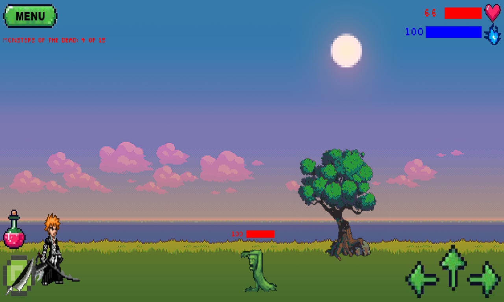
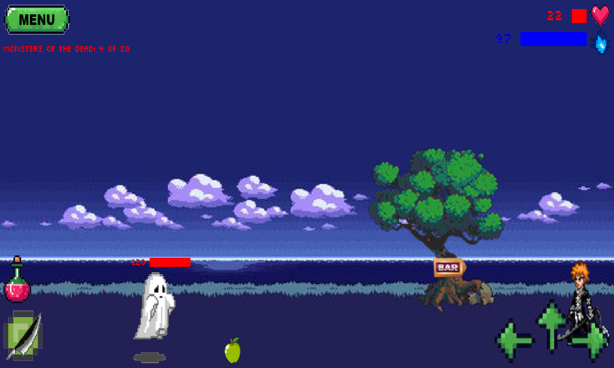

<p align="center"></p>
<h1 align="center">BAGP Game</h1>

## Description
<b>EN:</b>

A custom made 2D arcade game. Developed using the framework [**libGDX**](https://libgdx.com).

In the style of the anime **Bleach** and a 2D platformer.

<b>UA:</b>

Аркадна 2D гра, створена на замовлення. Розроблена за допомогою фреймворку [**libGDX**](https://libgdx.com).

В стилі аніме **Bleach** та 2D платформера.

#
## Screenshots
<p align="center">
  
  
  
  
  
  
  
  
  
  
  
  
  
  
  
  
  
  
  
  
  
  
</p>

#
## Technologies used
<b>EN:</b>
- Creating a 2D game using the library [**libGDX**](https://libgdx.com)
- Work on such platforms as: **Windows, macOS, GNU/Linux, Android, iOS**
- Advanced game settings
- Different behaviors on different platforms
- Creation of game console commands
- Lots of streaming
- Creating animations in **Adobe Photoshop**

<b>UA:</b>
- Створення 2D гри за допомогою бібліотеки [**libGDX**](https://libgdx.com)
- Робота на таких платформах як: **Windows, macOS, GNU/Linux, Android, iOS**
- Розширені налаштування гри
- Різні поведінки на різних платформах
- Створення консольних команд гри
- Багато потоковість
- Створення анімацій в **Adobe Photoshop**

#
## License
```
© 2023, CoolOtaku (ericspz531@gmail.com)
```
